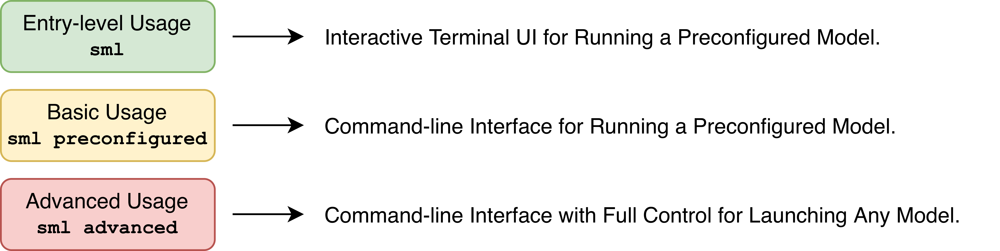

# `sml`: Swiss AI Model Launch

A CLI app for launching AI models on clusters.

## Installation

Requires Python 3.12 or later.

- SSH

  ```bash
  pip install git+ssh://git@github.com/swiss-ai/model-launch.git
  ```

- HTTPS

  ```bash
  pip install git+https://github.com/swiss-ai/model-launch.git
  ```

To verify installation, run:

```bash
sml --version
```

If you want to contribute to the project, please follow the instructions in the [Development](#development) section to set up the development environment instead of the above installation.

## Before You Begin

Before diving into the documentation, take a moment to determine where you fit in the SML ecosystem.

### Where Will You Run SML?

You can run SML on your local machine and it will submit jobs to the cluster via FirecREST. Or, you can SSH into the cluster and directly run SML there. You can choose the option that best suits your needs and preferences. Your choice will only affect the initialization process, but not the rest of the usage. This choice will affect how you initialize SML and which credentials you need to provide. The two options are:

1. FirecREST
2. SLURM

### What Is My Use Case?

SML is designed for users at different levels of expertise, from those who only want to launch a pre-configured model with a few clicks, to those who want to have full control over the model and serving configuration.



Before proceeding to the next sections, please take a moment to identify which user level you belong to. This will help you navigate the documentation and find the most relevant information for your needs. Then you can follow the instructions in the [Usage](#usage) section that best suits your needs.

## Initialization

Before using `sml`, you need to initialize it with your credentials and configurations. This is a one-time setup that will allow `sml` to authenticate and interact with the necessary services for launching models on the cluster. To do the first-time initialization, simply run

```bash
sml
```

And proceed with the interactive prompts. You can also pre-fill the prompts with CLI arguments or environment variables to skip the interactive setup. Please refer to the table below for the available options for pre-filling the initialization prompts:

| CLI Argument                | Environment Variable             | Description                                            |
| --------------------------- | -------------------------------- | ------------------------------------------------------ |
| `--launcher`                |                                  | Job submission method (`firecrest` or `slurm`)         |
| `--firecrest-url`           |                                  | FirecREST API URL (default: CSCS endpoint)             |
| `--firecrest-token-uri`     |                                  | FirecREST token URI (default: CSCS auth endpoint)      |
|                             | `SML_FIRECREST_CLIENT_ID`        | FirecREST client ID                                    |
|                             | `SML_FIRECREST_CLIENT_SECRET`    | FirecREST client secret                                |
|                             | `SML_CSCS_API_KEY`               | CSCS API key for health checks                         |
| `--telemetry-endpoint`      |                                  | Endpoint for telemetry reports                         |

Please note that FirecREST related fields (`--firecrest-url`, `--firecrest-token-uri`, `SML_FIRECREST_CLIENT_ID`, `SML_FIRECREST_CLIENT_SECRET`) are only required if you choose `firecrest` as the launcher method. The CSCS API key (`SML_CSCS_API_KEY`) is required regardless of the launcher method.

The configuration is saved to `~/.sml/config.yml`. You can override the config directory by setting the `SML_CONFIG_DIR` environment variable.

For re-doing the initialization, you can simply run the `sml init` command, which will guide you through the initialization process again and overwrite the previous configuration.

## Usage

Once you have figured out the answer to the question [What Is My Use Case?](#what-is-my-use-case), you can follow the instructions in the corresponding section below ([Entry-level and Basic Usage](#entry-level-and-basic-usage) or [Advanced Usage](#advanced-usage)) to learn how to use `sml` for your specific use case.

### Entry-level and Basic Usage

Once you have done the initialization, you can simply use `sml` (or `sml preconfigured`) to launch a model with a few clicks. This will guide you through selecting a pre-configured model and providing the necessary launch configuration in an interactive manner. This is the recommended option for users who want to quickly launch a model without worrying about the details of the configuration.

If you want to skip the interactive prompts and launch a pre-configured model directly, you can use CLI arguments to pre-fill the necessary information. Please refer to the table below for the available options for pre-filling the launch configuration prompts:

| Argument                | Environment Variable             | Description                                                            |
| ----------------------- | -------------------------------- | ---------------------------------------------------------------------- |
| `--firecrest-system`    | `SML_FIRECREST_SYSTEM`           | Target system to launch on (required only if using FirecREST launcher) |
| `--partition`           | `SML_PARTITION`                  | SLURM partition to use                                                 |
| `--reservation`         | `SML_RESERVATION`                | SLURM reservation name (optional)                                      |
| `--model`               |                                  | Model to launch (`<vendor>/<model>`)                                   |
| `--framework`           |                                  | Inference framework to use                                             |
| `--workers`             |                                  | Number of workers                                                      |
| `--use-router`          |                                  | Load balance across workers (`yes`, `no`)                              |
| `--time`                |                                  | Job time limit (`HH:MM:SS`)                                            |

For simplicity of usage, it is strongly advised to use environment variables to pre-fill `SML_FIRECREST_SYSTEM` and `SML_PARTITION`, as these are required for every job submission and they are usually constant for a user.

```bash
export SML_FIRECREST_SYSTEM=clariden
export SML_PARTITION=normal
```

If any of the above information is not provided via CLI arguments or environment variables, you will be prompted to provide it interactively. For the ones with both CLI arguments and environment variables, the priority is given to CLI arguments, meaning that if both are provided, the value from the CLI argument will be used.

#### Example of Basic Usage

```bash
export SML_FIRECREST_SYSTEM=clariden
export SML_PARTITION=normal

sml preconfigured \
  --model swiss-ai/Apertus-8B-Instruct-2509 \
  --framework sglang \
  --workers 1 \
  --time 02:00:00
```

Once the job is submitted, `sml` opens a TUI displaying the job status and live logs.

### Advanced Usage

For full control over the SLURM job, use `sml advanced`. This bypasses the model catalog and lets you specify all launch parameters directly. See [`examples/`](examples/) for ready-to-use scripts per model. System and partition are still selected the same way as before (interactive or via args/env vars).

| Argument                   | Environment Variable      | Description                                                       |
| -------------------------- | ------------------------- | ----------------------------------------------------------------- |
| `--firecrest-system`       | `SML_FIRECREST_SYSTEM`    | Target HPC system to launch on                                    |
| `--partition`              | `SML_PARTITION`           | SLURM partition to use                                            |
| `--slurm-reservation`      | `SML_RESERVATION`         | SLURM reservation name (optional)                                 |
| `--serving-framework`      |                           | Inference framework (`sglang`, `vllm`) — **required**             |
| `--slurm-environment`      |                           | Local path to the environment `.toml` file — **required**         |
| `--framework-args`         |                           | Arguments forwarded to the inference framework                    |
| `--slurm-nodes`            |                           | Total number of nodes (default: `workers × nodes-per-worker`)     |
| `--slurm-workers`          |                           | Number of workers (default: `1`)                                  |
| `--slurm-nodes-per-worker` |                           | Nodes per worker (default: `1`)                                   |
| `--slurm-time`             |                           | Job time limit in `HH:MM:SS` (default: `00:05:00`)                |
| `--served-model-name`      |                           | Name under which the model is served (auto-generated if omitted)  |
| `--worker-port`            |                           | Port used by workers (default: `5000`)                            |
| `--use-router`             |                           | Enable router to load balance across workers                      |
| `--router-args`            |                           | Arguments forwarded to the router                                 |
| `--disable-ocf`            |                           | Disable OCF wrapper                                               |
| `--pre-launch-cmds`        |                           | Shell commands to run before the framework starts                 |

Again, for simplicity of usage, it is strongly advised to use environment variables to pre-fill `SML_FIRECREST_SYSTEM` and `SML_PARTITION`, as these are required for every job submission and they are usually constant for a user.

#### Example of Advanced Usage

```bash
export SML_FIRECREST_SYSTEM=clariden
export SML_PARTITION=normal

sml advanced \
  --slurm-nodes 1 \
  --serving-framework sglang \
  --slurm-environment src/swiss_ai_model_launch/assets/envs/sglang.toml \
  --framework-args "--model-path /capstor/store/cscs/swissai/infra01/hf_models/models/swiss-ai/Apertus-8B-Instruct-2509 \
    --served-model-name swiss-ai/Apertus-8B-Instruct-2509-$(whoami) \
    --host 0.0.0.0 \
    --port 8080"
```

## Development

### Setting Up Development Environment

```bash
git clone git@github.com:swiss-ai/model-launch.git && cd model-launch
uv venv --python 3.12
source .venv/bin/activate
uv pip install -e ".[dev]"
pre-commit install
```

### Testing Environment

For writing the integration tests, you have to create a `.test.sh` file in the root of the repository with the following content:

```shell
export FIRECREST_URL=<your-firecrest-url>
export FIRECREST_TOKEN_URI=<your-token-uri>
export FIRECREST_CLIENT_ID=<your-client-id>
export FIRECREST_CLIENT_SECRET=<your-client-secret>
export FIRECREST_SYSTEM=clariden
export FIRECREST_ACCOUNT=<your-account>
export FIRECREST_PARTITION=normal
export CSCS_API_KEY=<your-api-key>
export RESERVATION=<your-reservation>
```

This file will be sourced when running the tests with `make test`, and the environment variables will be available for the tests.

### Common Commands

There is a `Makefile` with common development commands.

1. To format code, you can run:

   ```bash
   make format
   ```

2. To run tests, you can run:

   ```bash
   make test
   ```

3. To clean up cache files, you can run:

   ```bash
   make clean-cache
   ```

4. To clean up the env and cache, you can run:

   ```bash
   make clean-dev
   ```

## Appendix

### Acquiring FirecREST Credentials

Please follow the instructions in the [FirecREST documentation](https://docs.cscs.ch/services/devportal/#manage-your-applications) to acquire the necessary credentials for authentication from [Developer Portal](https://developer.svc.cscs.ch/devportal/apis).

### Acquiring CSCS API Key

Please proceed to [serving platform](https://serving.swissai.svc.cscs.ch) and log in using your institutional account. Then, navigate to the "View API Keys" section. You will see your API key listed there.
