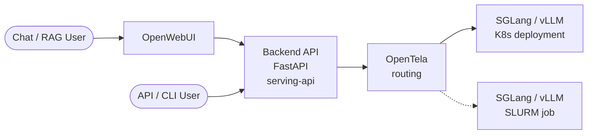

# Architecture

SML is a thin orchestrator. It doesn't serve models itself — it submits SLURM jobs that bring up an inference framework (sglang or vLLM) on cluster nodes, optionally fronted by a router for load balancing.

## Request flow at a glance

A user request reaches a model the same way whether the model lives on Kubernetes or in a SLURM job. OpenTela picks whichever backend has the model registered.



**K8s** = always-on deployment, managed separately. **SLURM** = what SML provisions, time-limited. From the API's and user's perspective, the two are interchangeable — that's what OpenTela buys you.

## Components

```text
┌──────────┐    ┌──────────────┐    ┌─────────────────────┐
│  user    │ ─► │  sml CLI     │ ─► │  FirecREST / SLURM  │
│  / MCP   │    │  (this repo) │    │  job submission     │
└──────────┘    └──────────────┘    └──────────┬──────────┘
                                               │
                                  ┌────────────▼─────────────┐
                                  │   SLURM job (per launch) │
                                  │  ┌──────────────────────┐│
                                  │  │ router (optional)    ││
                                  │  └─────────┬────────────┘│
                                  │  ┌─────────▼────────────┐│
                                  │  │ N replicas           ││
                                  │  │  ┌──────────┐         ││
                                  │  │  │ sglang / │         ││
                                  │  │  │ vLLM     │         ││
                                  │  │  └────┬─────┘         ││
                                  │  └───────┼───────────────┘│
                                  │  ┌───────┼───────────────┐│
                                  │  │ DCGM + vmagent        ││
                                  │  └────┬──┼───────────────┘│
                                  └───────┼──┼────────────────┘
                                          │  │
                                          │  └──► OpenTela p2p mesh ◄── serving-api
                                          │                              (public gateway)
                                          │
                                          └──► telemetry endpoint ──► Grafana
```

Two independent planes leave the job:

- **Request plane** (right): each replica registers itself on the **OpenTela p2p mesh** at startup. The serving-api gateway resolves model names through OpenTela and forwards requests to a registered peer. Skip the registration with `--disable-ocf` (see below).
- **Metrics plane** (bottom): DCGM and vmagent scrape per-GPU and per-process metrics and push them to the telemetry endpoint, which Grafana reads from. Separate system; not OpenTela.

## Repos in the serving stack

SML is one piece of a larger system. The siblings:

- **[swiss-ai/model-launch](https://github.com/swiss-ai/model-launch)** — this repo. The CLI and MCP server.
- **[swiss-ai/serving-api](https://github.com/swiss-ai/serving-api)** — the public-facing inference gateway at [serving.swissai.svc.cscs.ch](https://serving.swissai.svc.cscs.ch/). Resolves model names against OpenTela and forwards requests to a registered peer.
- **[swiss-ai/opentela](https://github.com/swiss-ai/opentela)** — the **p2p service mesh** that connects models regardless of where they live (SLURM job, Kubernetes pod, any network or location). Each replica registers itself on the mesh at startup, under the served model name. By default OpenTela does **random assignment among peers** registered under the same name — that's the load-balancing primitive. OpenTela is what makes a model launched here on Clariden interchangeable, from the gateway's perspective, with the same model running in a k8s deployment elsewhere.

## Request path (typical SML deployment)

1. User runs `sml advanced ...` (or interactive `sml`).
2. SML serializes launch args, builds an `sbatch` script, submits via FirecREST or directly via SLURM.
3. SLURM allocates nodes; the job script starts the inference framework on each replica.
4. Each replica registers itself on the OpenTela p2p mesh under the served model name (unless `--disable-ocf` was passed).
5. (Optional) `--use-router` puts a framework router (e.g. sglang-router) in front of the replicas inside the job. This is orthogonal to OpenTela — the router shapes traffic *within* the job; OpenTela picks *which* job/peer a request lands on.
6. DCGM exporter and vmagent start in sidecar fashion on each replica node, pushing metrics to the telemetry endpoint.
7. A user request hits serving-api → serving-api uses OpenTela to look up the model name and pick a registered peer → the request flows through the OpenTela mesh to that peer, where the peer's local OpenTela layer hands it off to the framework process.

## Disabling OpenTela registration: `--disable-ocf`

By default each replica joins the OpenTela mesh at startup. Pass `--disable-ocf` to skip the registration. The framework still runs and serves on its replica port inside the cluster, but it never joins the mesh — so:

- It is **not reachable through [serving-api](https://github.com/swiss-ai/serving-api)** at [serving.swissai.svc.cscs.ch](https://serving.swissai.svc.cscs.ch/).
- It is only reachable directly via host:port from another job on the same cluster.

Use `--disable-ocf` for private models, raw-throughput benchmarks (no OpenTela hop), or when you've stood up your own routing in front of the replicas. See [usage-advanced.md](usage-advanced.md#when-to-disable-ocf).

> The flag is named `--disable-ocf` for historical reasons — `OCF` is the on-disk binary name from the OpenTela project. Treat the two as one thing.

## Where SML's responsibility ends

SML's job is "get the framework process running on the right nodes with the right args, and stream you the logs until it's healthy." It does not:

- Persist the deployment past the SLURM time limit (use k8s for that — see [FAQ](faq.md#i-want-to-keep-a-model-running-247-can-sml-do-that)).
- Route public traffic (that's serving-api + OpenTela).

This separation keeps SML small enough that a single user can read the whole codebase in an afternoon.

## Next

- [How to size a model](sizing.md) — picking the layout the architecture above will materialize
- [MCP](mcp.md) — driving the same orchestrator from an LLM client
