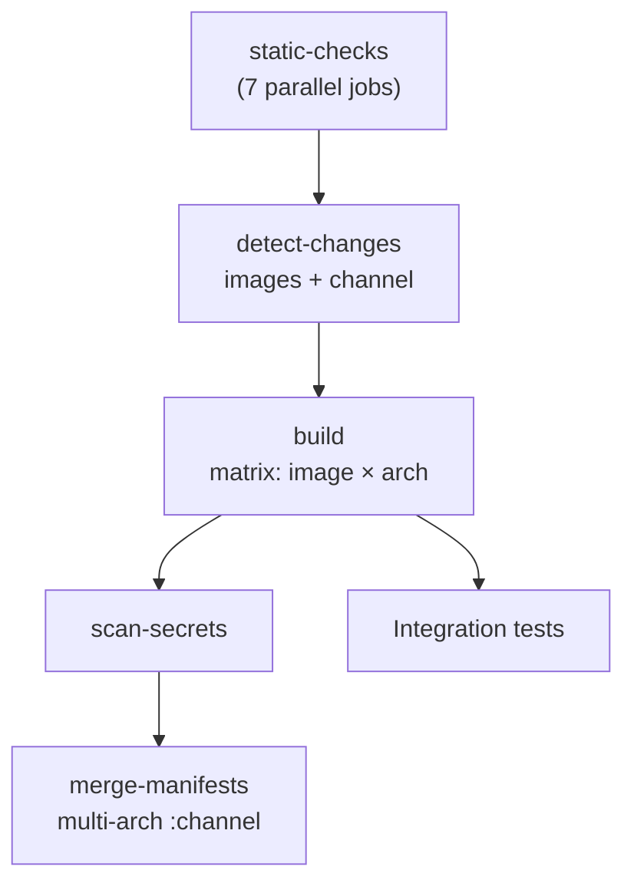

# CI/CD

The main pipeline ([`ci.yml`](https://github.com/swiss-ai/model-launch/blob/main/.github/workflows/ci.yml)) runs in sequential stages, each gating the next:

> Static Checks → Changed-Image Detection → Docker Image Builds → Secret Scan → Manifest Merge → Integration Tests

Images are not built on the GitHub runner. The build job submits a **SLURM job via FirecREST** and polls it — the runner is a thin client, and the container is built on the same hardware the models run on.

Integration tests branch off `build` directly — they need the images to exist, not the release to be published.

## Workflows

| Workflow | Trigger | What it does |
| --- | --- | --- |
| `ci.yml` | push to `main`, PRs, dispatch | The pipeline below |
| `static.yml` | called by `ci.yml` | Lint, format, type checks |
| `docs.yml` | `docs/`, `mkdocs.yml`, `pyproject.toml` changes | `mkdocs build --strict`; deploys Pages from `main` |
| `sonar.yml` | push to `main`, PRs | Unit tests + coverage → SonarCloud |
| `cleanup-pr-images.yml` | PR closed | Deletes that PR's pre-release artifacts |

## Triggers

| Event | Behaviour |
| --- | --- |
| PR to `main` | Full pipeline; images publish to `pr-<number>` |
| Push to `main` | Full pipeline; images publish to `latest` |
| Draft PR | Static checks only |
| `workflow_dispatch` | Optional single-image build; runs comprehensive tests |

PRs re-run on `opened`, `reopened`, `synchronize`, `labeled`, `ready_for_review` — the `labeled` trigger is what lets you switch test tiers without a new commit.

## Stage 1: static checks

Seven parallel jobs: `ruff` lint/format, `mypy`, `shellcheck`, `hadolint`, `markdownlint`, `taplo` (TOML), `prettier` (JSON/YAML).

All reproducible locally with `make static`, or individually (`make lint`, `make dockerlint`, …). See [Development](development.md#common-make-targets).

## Stage 2: changed-image detection

Computes which image directories changed and emits a JSON matrix; entries are validated against real directories.

| Event | Images built |
| --- | --- |
| Pull request | Changed vs. base branch |
| Push to `main` | Changed between `before` and `after` |
| First push / no `before` SHA | All |
| `workflow_dispatch` | The `image` input, or all if empty |

No matches → `[]`, and build/scan/merge all skip.

### Release channels

The same job resolves the **release channel**, the pipeline's core safety property:

- **PR** → `pr-<number>`: isolated registry tags and capstor subdirectory, so a PR build can never overwrite what main published.
- **`main`** → `latest`.
- **Anything else** → deliberate failure.

`:latest` means "built from main", so this gates on the ref, not the event: a dispatch from a feature branch with an empty `image` input would otherwise republish all of `:latest` from unmerged code. `build_image.py` independently rejects any channel that isn't `latest` or `pr-<number>` — the value lands in both a filesystem path and a registry tag.

## Stage 3: image builds

Matrix of **image × arch**, `fail-fast: false`.

Each arch builds natively on its own cluster via a different FireCREST endpoint: arm64 uses the base `SML_FIRECREST_URL` / `SML_SYSTEM` / `SML_PARTITION`, amd64 uses strictly `_AMD64`-suffixed variables. There is **no fallback** — falling back would silently build amd64 on the arm64 cluster.

[`build_image.py`](https://github.com/swiss-ai/model-launch/blob/main/.github/scripts/build_image.py) uploads `images/<name>/` to an arch- and channel-suffixed remote dir, submits the batch script (1 node, 64 CPUs, 4 h), polls every 60 s, and on failure downloads the job's stdout/stderr into the Actions log.

On the cluster: `podman build --format docker` → push `:<channel>-<arch>` → `enroot import` to squashfs → copy to capstor via `.tmp` + atomic `mv`. An `EXIT` trap cleans up the local image, scratch sqsh, and podman runtime dir.

**Caching.** Each leg has a sentinel keyed on channel, image, arch, and `hashFiles('images/<image>/**')`; a hit skips the build entirely. The channel is in the key because a PR build only proves the `pr-<N>` artifacts exist — otherwise merging an already-built PR would hit the cache and never publish `:latest`.

## Stage 4: secret scan

[`scan_image.py`](https://github.com/swiss-ai/model-launch/blob/main/.github/scripts/scan_image.py) scans the **layered image on GHCR**, not the flattened sqsh: a credential added in one layer and deleted in a later one vanishes from the sqsh but stays pullable forever. Per layer it checks file contents (`trufflehog`), credential-shaped filenames (`.netrc`, `id_rsa`), and the image config.

**Failure policy:** verified findings and high-signal detectors (private keys, GitHub/AWS/HF tokens, credentialed URIs) fail the scan. Everything else warns — large ML images are full of high-entropy noise.

False positives go in [`.github/image-scan-allowlist.txt`](https://github.com/swiss-ai/model-launch/blob/main/.github/image-scan-allowlist.txt) as `raw:<regex>` or `path:<glob>`. If in doubt, treat the finding as real and **rotate the credential** — the layer is already pushed.

Scans use their own sentinel cache, keyed additionally on the scanner and allowlist. They run in `/mnt` (the runner's root disk is too small for the largest layers) and cap at 90 minutes.

## Stage 5: manifest merge

Combines the per-arch tags into `ghcr.io/swiss-ai/<image>:<channel>` with `docker buildx imagetools create`.

Runs only if **every** arch built and **no** scan failed. A partial set would publish a single-arch manifest under a tag consumers expect to be multi-arch; and although per-arch tags are already pushed, a failed scan blocks the multi-arch release.

## Stage 6: integration tests

Tests hit a real cluster over FireCREST. Exactly one tier runs per PR:

| Tier | Selected by | Target |
| --- | --- | --- |
| Lightweight | default | `make _test-lightweight` (`-n 2`) |
| Standard | `requires-std-tests` label | `make _test-std` (`-n 13`) |
| Comprehensive | `requires-comprehensive-tests` label, or dispatch | `make _test-comprehensive` (`-n 28`) |

Comprehensive wins over std, which wins over the default. All tiers gate on `needs.build.result != 'failure'` under `always()`, so they still run when there was no image to build (a Python-only PR) but not when a build broke.

Locally, use the non-underscore targets (`make test-lightweight`) — they source `.test.sh` for credentials. See [Development](development.md#test-environment).

## Cleanup on PR close

Deletes the three GHCR tags (`pr-N`, `pr-N-arm64`, `pr-N-amd64`) for every image plus the `pr-N` capstor directory. Tag matching is exact — a prefix match on `pr-4` would also delete `pr-42`. Both steps are `continue-on-error`; leftover artifacts never fail the workflow. Uses `GHCR_DELETE_TOKEN` when the default token lacks package admin.

## Configuration

| Name | Kind | Used for |
| --- | --- | --- |
| `SML_FIRECREST_CLIENT_ID` / `_SECRET` / `_TOKEN_URI` | secret | FireCREST auth (shared across clusters) |
| `SML_SWISSAI_RESEARCH_API_KEY` | secret | Integration tests |
| `SML_FIRECREST_URL`, `SML_SYSTEM`, `SML_PARTITION`, `SML_RESERVATION` | variable | arm64 cluster |
| `SML_FIRECREST_URL_AMD64`, `SML_SYSTEM_AMD64`, `SML_PARTITION_AMD64` | variable | amd64 cluster (no reservation) |
| `GITHUB_TOKEN` | automatic | GHCR push/read, manifest merge |
| `GHCR_DELETE_TOKEN` | secret (optional) | PR cleanup |
| `SONAR_TOKEN` | secret | SonarCloud (skipped for forked PRs) |

## When something fails

| Symptom | Cause |
| --- | --- |
| Stops before any build | A static check failed — reproduce with `make static` |
| No build jobs ran | No changed image directories, or the PR is a draft |
| Build fails with a SLURM state | Job stdout/stderr are printed in the Actions log |
| `Refusing to publish images from refs/heads/...` | Dispatch from a non-`main` branch — open a PR |
| `Missing FireCREST config for arch 'amd64'` | An `_AMD64` variable is unset; no fallback by design |
| Build "succeeded", image unchanged | Sentinel cache hit — nothing under `images/<name>/` changed |
| Merge skipped after a green build | The other arch failed, or a scan failed |
